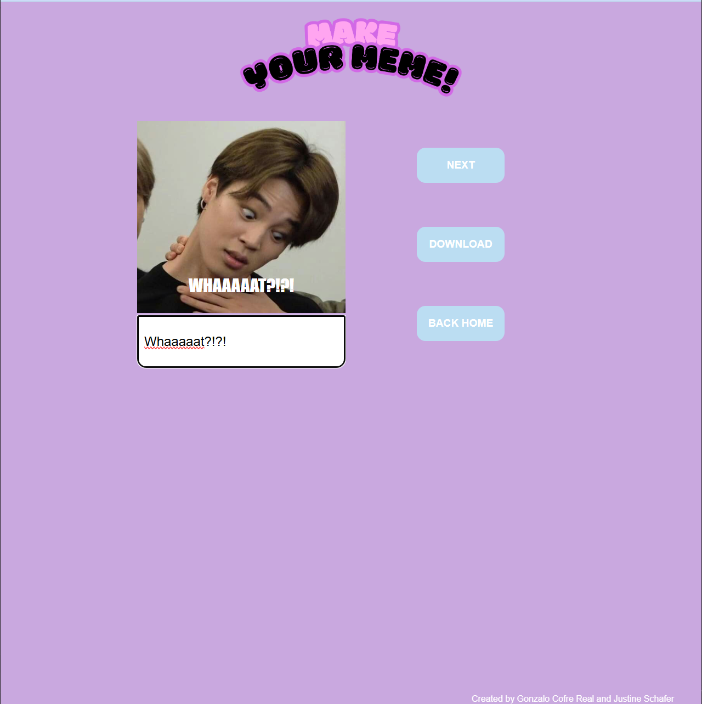
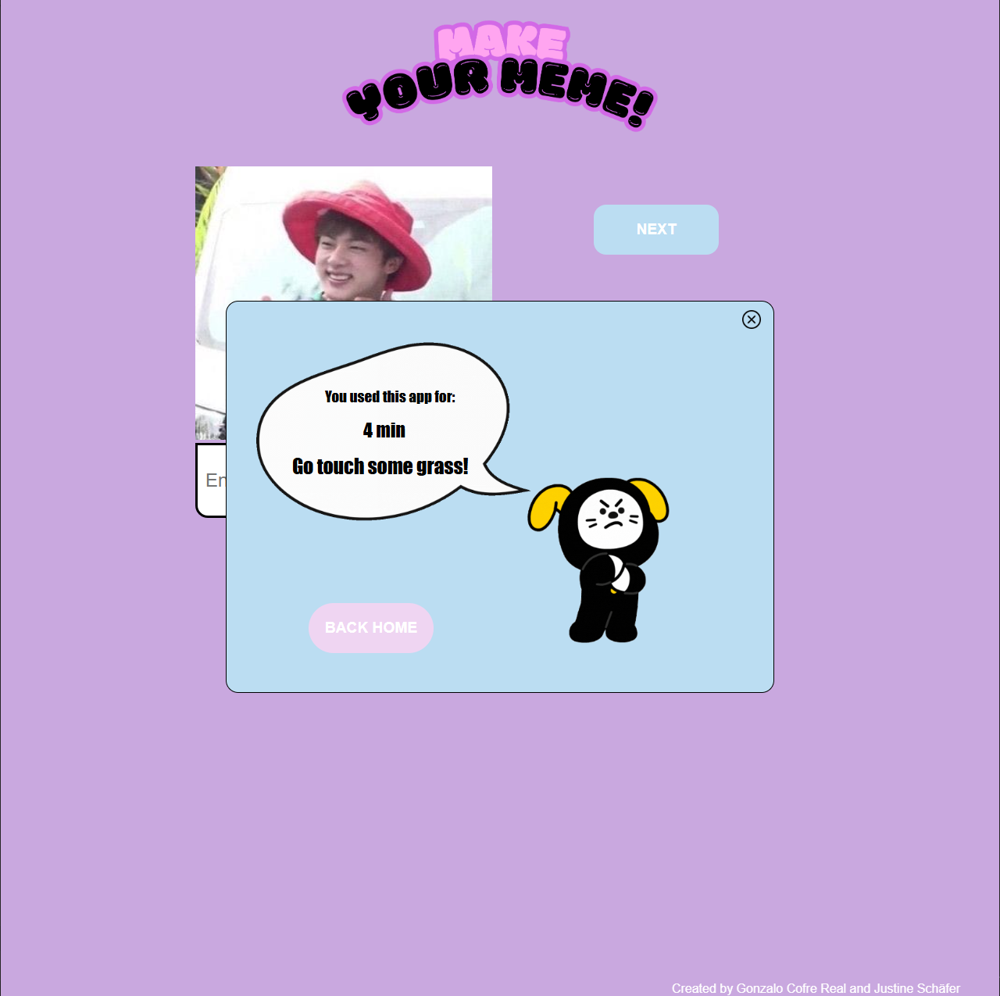

# Kursprojekt-2-Prototype
## A functional website prototype written in HTML/CSS/JavaScript which lets users create their own BTS-Memes.

This Project is a prototype of a web application, which allows users to explore the funny world of BTS by creating and downloading their own memes. This project was built and designed for the 'Medieninformatik'-Course at the University of Stuttgart. 
These are the funcionalities of the application:

* Switching from landing page to game page.
* Writing text overlayed to an BTS-MEME image.
* Skipping through a number of BTS-MEME images.
* Downloading the created Image with the overlayed text.
* Tracking the time spent on the site.

## How to install this protoype
We have provided a Folder containing all the files of the project, which can be opened in your IDE of choice.
We used VSCode, which has very useful features and allows for a live server view of the website.
Alternatively follow the Link on the GitHub to clone the Repository:

[Our GitHub Repo](https://github.com/Gonzo-CR/Kursprojekt-2-Prototype)

You can also use git to clone the repository:

`$ git clone https://github.com/Gonzo-CR/Kursprojekt-2-Prototype.git`

>[!TIP]
>We recommend using VSCode to open the project, because we also recommend the extension Live Server, which runs the website on a live server for us.

## How to use the protoype

On the landing page, you have to click the ***START*** Button to get to the game page.

Now on the game page, you are free to input text into the provided textfield.

You can also skip to the next MEME by clicking the ***NEXT*** button. You can only view 10 Memes before recieving a popup-message to go outside.
Click the ***DOWNLOAD*** button to save your meme to your computer.

Done with making Memes? Click the ***BACK HOME*** button to reveal a Popup-Window telling you how much time you have spent on the platform. Your able to exit that view by clicking the ***X*** Icon or leave the game by clicken the ***BACK HOME*** button.

## The 3 Criteria

1. Images can be edited with text: Our application allows the user to edit the image by adding text to it. One of the primary crieria for the prototype.
2. The protoype should make the user aware of their time spent on the platform: We have incorporated this criteria by implementing a popup-window, which tells the user the time they spent using the app. So whenever they want to leave the platform, they will always know how much time they've spent. We also integrated a maximum amount of Memes you can view. You can only skip 10 times till the website shows you the popup window. After that you can no longer view new Memes.
3. The prototype should provide a intuitive UI for the user: Our website is not very complicated and packed with features and functions. We believe to have achieved a very minimalist but intuitive design, which allows the user to immediatley understand, how to use the site. There are only three buttons grouped together which tell you exactly what they are for, just as the input field.

## Conclusion

We are proud to present to you our prototype. We hope you are having fun with it. We most certainly did. Due to its nature of being a prototype, the website could present handling issues and does not include features which you might expect it to have. You are always welcome to ask questions about the protoype, we are happy to provide information.

## Authors

This website was designed and built by Gonzalo Cofre Real and Justine Schäfer.
